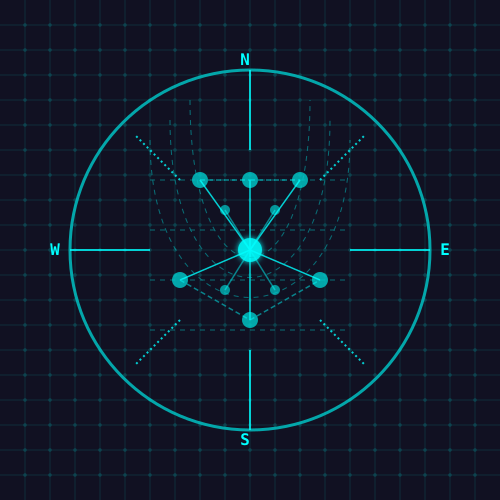

# SecureCartographyVSC



## Network Discovery and Visualization for Visual Studio Code

SecureCartographyVSC is a comprehensive VS Code extension that brings enterprise-grade network discovery, mapping, and visualization capabilities directly into your development environment. Map your entire network infrastructure with a few clicks, visualize complex network topologies, and enhance your network security assessment workflows.

[](https://marketplace.visualstudio.com/items?itemName=ScottPeterman.network-mapper)
[](https://marketplace.visualstudio.com/items?itemName=ScottPeterman.network-mapper)
[](https://marketplace.visualstudio.com/items?itemName=ScottPeterman.network-mapper)
[](LICENSE)

## Features

- **Pure JavaScript Implementation**: No external dependencies or commands required
- **Enterprise-Grade Network Discovery**: Discover and map network infrastructure using CDP/LLDP
- **Multi-Device Support**: Works with Cisco, Juniper, and other network vendors
- **Interactive Topology Visualization**: View your network in an interactive graphical interface
- **Multiple Export Formats**: Export to Draw.io, GraphML, JSON, and more
- **Flexible Authentication**: Support for username/password, SSH keys, and enable passwords
- **Recursive Discovery**: Automatically discover adjacent devices up to a specified hop count
- **Extensible Parsing System**: TextFSM and regex-based parsing for device outputs
- **Detailed Device Information**: Collect comprehensive device data (interfaces, models, OS versions)
- **Configurable Exclusions**: Control discovery scope with exclusion patterns

## Installation

Install SecureCartographyVSC directly from the [Visual Studio Marketplace](https://marketplace.visualstudio.com/items?itemName=ScottPeterman.network-mapper) or by searching for "Network Mapper" in the VS Code Extensions view.

### Via VS Code
1. Open VS Code
2. Go to Extensions (Ctrl+Shift+X)
3. Search for "Network Mapper"
4. Click Install

### Via Command Line
```bash
code --install-extension ScottPeterman.network-mapper
```

## Quick Start

1. Click the Network Mapper icon in the VS Code activity bar
2. Enter seed device IP addresses (comma or semicolon separated)
3. Provide authentication credentials (username:password format)
4. Click "Start Discovery" to begin mapping your network
5. View results in the interactive topology viewer

## Usage Guide

### Network Discovery

The discovery process starts with "seed" devices - network devices you specify as entry points. From there, the tool:

1. Connects to each seed device using SSH
2. Collects neighbor information via CDP/LLDP
3. Discovers new devices connected to your seeds
4. Repeats the process up to your specified hop count
5. Generates a comprehensive network map

#### Example Seed Device Format:
```
router1,192.168.1.1;switch1,10.0.0.1
```

#### Example Credentials Format:
```
admin:password
operator:securepass
```

### Topology Visualization

After discovery completes, you can:

1. View the raw JSON topology data
2. Open the interactive topology viewer 
3. Export to various formats including Draw.io and GraphML

The topology viewer provides an interactive graph visualization with device filtering, layout controls, and detailed device information.

## Advanced Configuration

### Extension Settings

* `networkMapper.templatePath`: Path to TextFSM templates (leave blank to use included templates)
* `networkMapper.outputPath`: Default path for output files
* `networkMapper.maxHops`: Default maximum hop count for network discovery
* `networkMapper.maxThreads`: Maximum number of concurrent discovery threads
* `networkMapper.scanTimeout`: Timeout in milliseconds for scanning each device
* `networkMapper.logLevel`: Logging level (debug, info, warn, error)

## Architecture

SecureCartographyVSC is built around a modular, event-driven architecture with several key components:

- **NetworkDiscovery**: Orchestration engine for the discovery process
- **SynchronousSSHClient**: Pure JavaScript SSH implementation
- **ExtensibleParser**: Sophisticated multi-method parser for device outputs
- **TopologyViewer**: Interactive visualization of network maps

For a detailed technical overview, see the [Architecture Documentation](README_Discovery.md).

## Screenshots


## Use Cases

- **Network Documentation**: Automatically document your network infrastructure
- **Change Management**: Visualize network changes and topology shifts
- **Security Assessment**: Identify unauthorized or unknown devices 
- **Troubleshooting**: Visualize network paths and connectivity issues
- **Network Planning**: Understand your current topology for expansion planning

## Contributing

Contributions are welcome! Please feel free to submit a Pull Request.

1. Fork the repository
2. Create your feature branch (`git checkout -b feature/amazing-feature`)
3. Commit your changes (`git commit -m 'Add some amazing feature'`)
4. Push to the branch (`git push origin feature/amazing-feature`)
5. Open a Pull Request

## License

This project is licensed under the MIT License - see the [LICENSE](LICENSE) file for details.

## Acknowledgments

- TextFSM for structured parsing
- Draw.io for diagram export capabilities
- GraphML for standard graph representation
- The VS Code team for their excellent extension API

---

Built with ❤️ by [Scott Peterman](https://github.com/ScottPeterman)